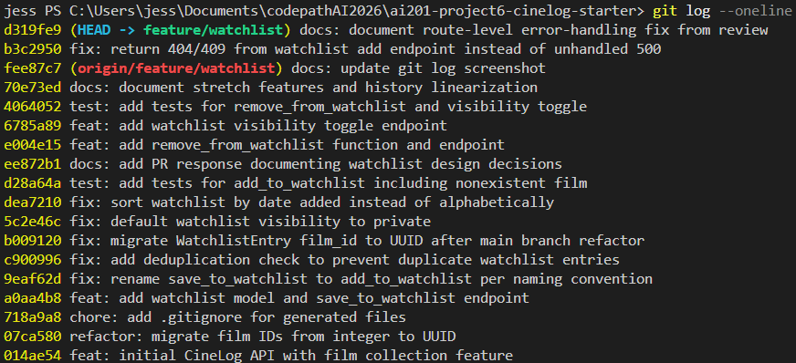

# PR Response Doc — CineLog Watchlist Feature

## AI Usage

I used Claude Code (Anthropic's CLI) in a few concrete ways on this PR:

- **Codebase orientation.** I asked it to map how the collection feature was structured
  (`services/collection_service.py`, `routes/collection.py`, `tests/test_collection.py`) so I
  could follow the same conventions in the watchlist code rather than inventing my own.
- **Pattern matching.** For the deduplication fix (Comment 2) and the new test (Comment 3) I
  used `add_to_collection` and `test_add_to_collection_nonexistent_film_raises` as models, and
  used AI to confirm I had mirrored the fixture and assertion structure faithfully.
- **Stress-testing my design arguments.** For Comments 4 and 5 I asked the AI to argue the
  *opposite* of my position (keep public-by-default; keep alphabetical) so I could make sure my
  reasoning held up against the strongest counter-argument. My final positions below are my own;
  what the AI surfaced mainly sharpened the tradeoff paragraphs — e.g. it pushed me to
  acknowledge the discovery cost of a private default, which I now name explicitly.
- **Verifying commit hygiene.** I ran my `git log --oneline` past the AI to check the messages
  follow Conventional Commits and that no single commit bundled two logical changes, then
  verified against the spec myself.

<!-- Personalize this section with anything else you actually did, and adjust the wording so it
     reflects your own process. -->

---

## Comment 1 — Rename

**What I did:** Renamed `save_to_watchlist()` to `add_to_watchlist()` in
`services/watchlist_service.py` to follow the project's `verb_to_noun` convention (matching
`add_to_collection()`).

**How I found all call sites:** I ran a project-wide search — `grep -rn "save_to_watchlist"`
across the repo — which surfaced exactly one caller, the import + call in
`routes/watchlist/watchlist.py`. I updated both the `from services.watchlist_service import ...`
line and the call inside `add_film()`. After the rename I re-ran the search for
`save_to_watchlist` and got zero matches, confirming nothing was missed.

**How I verified:** Full suite green (`pytest tests/ -v`), and the app imports cleanly (the
blueprint registers `add_to_watchlist` at startup).

## Comment 2 — Deduplication

**What I did:** Added a duplicate check to `add_to_watchlist()` that mirrors
`add_to_collection()`. Before inserting, it queries for an existing `WatchlistEntry` with the
same `(user_id, film_id)` and raises a new `AlreadyInWatchlistError` if one exists — parallel to
how the collection service raises `AlreadyInCollectionError`. I defined the exception in
`watchlist_service.py`, the same file that raises it, matching the collection service's layout.

**How I verified it works:** I added `test_add_to_watchlist_duplicate_raises` (in
`tests/test_watchlist.py`), which adds a film, asserts a second add raises
`AlreadyInWatchlistError`, and then asserts the row count for that `(user, film)` pair is exactly
`1` — proving no duplicate row was written. Modeled on
`test_add_to_collection_duplicate_raises`.

## Comment 3 — Missing test

**What I did:** Created `tests/test_watchlist.py`. The required test is
`test_add_to_watchlist_nonexistent_film_raises`, written as the direct equivalent of
`test_add_to_collection_nonexistent_film_raises` — same `app`/`sample_user` fixtures, same
`"00000000-0000-0000-0000-000000000000"` fake UUID, asserting `FilmNotFoundError`. I also brought
over the `sample_film` fixture and added a basic create test and the dedup test above so the
watchlist suite parallels the collection suite.

**Which test I modeled it on:** `tests/test_collection.py::test_add_to_collection_nonexistent_film_raises`.

**How I verified:**

```
pytest tests/test_watchlist.py -v   # 3 passed
pytest tests/ -v                    # 7 passed
```

## Comment 4 — Default visibility

**My position:** Change the default from `public=True` to **`public=False` (private by default).**

**Reasoning:** A watchlist is a record of intent — films someone *plans* to watch. That's closer
to personal/aspirational data than to a published review, and users don't necessarily expect
"save for later" to mean "broadcast to everyone." Defaulting to private optimizes for the
behavior I want to protect: a user should never be surprised to learn a list they treated as
private was visible. Privacy-by-default also ages better — you can always let users opt into
sharing, but you can't retroactively un-share a list someone assumed was private. If we're being
intentional (which is the point of this comment), the safe default when the data is personal is
the closed one.

**Tradeoff I'm accepting:** A private default has a real cost to *discovery and virality* — the
social/product upside of watchlists (friends seeing what you're planning to watch, driving
engagement) only happens if lists are visible, and defaults dominate behavior, so most lists will
now stay private unless the user acts. If CineLog's north star is social discovery, `public=True`
is the defensible call. I'm choosing to optimize for user trust over discovery here, and I'd
revisit it if product data showed sharing is core to retention. The mitigation is to make the
"make public" toggle prominent so users who *want* to share aren't buried.

## Comment 5 — Sort order

**My position:** Implement the maintainer's preference — **sort by date added, newest first**
(`WatchlistEntry.date_added.desc()`), replacing the alphabetical `Film.title.asc()`.

**Engagement with the reviewer's reasoning:** The maintainer's point — "most users want to see
what they added recently" — matches how a watchlist is actually used. It's a queue, not a
reference catalog. When I add a film I just heard about, my next visit I want it near the top, not
buried under titles starting with "A." Recency is also self-correcting: the thing most relevant to
me right now is usually the thing I touched most recently.

I considered two alternatives and rejected them:
- **Keep alphabetical.** Predictable and good for *finding a known title*, but on a watchlist you
  rarely know the exact title you're hunting for — you're browsing "what should I watch next?"
  Alphabetical buries recent adds and has no relationship to how fresh an item is.
- **A third option — manual/custom ordering.** Genuinely nice, but it's a bigger feature (drag
  ordering, a position column, reindex-on-delete). Out of scope for this PR, and date-added is a
  strictly better default than alphabetical in the meantime.

This also makes the watchlist consistent with `get_collection()`, which already sorts
`date_added` descending — so the two lists behave the same way, which is one less surprise for
users. I'm aligned with the maintainer and we've documented it, so this is decided.

## Comment 6 — Rebase

**What conflicted:** `feature/watchlist` was branched before `main`'s
`refactor: migrate film IDs from integer to UUID`. When I rebased onto `origin/main`, the conflict
was in `models.py`: my branch defined `Film.id` and the foreign-key `film_id` columns as
`db.Integer`, while `main` had migrated them to `db.String(36)` UUIDs. My new `WatchlistEntry`
model also declared `film_id = db.Column(db.Integer, ...)`, which no longer matched the UUID
`film.id` primary key it references.

**How I resolved it:** I took `main`'s side for the already-refactored models (`Film`,
`CollectionEntry`) and then updated my own watchlist code to match the new UUID world:
- `WatchlistEntry.film_id` → `db.String(36)` (FK to the UUID `film.id`).
- Docstrings in `watchlist_service.py` that described `film_id` as an integer → "UUID of the film".
- The `add` endpoint's docstring body example → `{ "film_id": "<uuid>" }`.

I kept this as its own commit (`fix: migrate WatchlistEntry film_id to UUID after main branch
refactor`) so the reason for the change is legible in history.

**How I confirmed the conflict was fully addressed:**
- `grep -rn "db.Integer" models.py` shows no integer foreign keys remain on the entry tables; the
  only remaining integers are genuine numeric fields (`Film.year`, `rating`).
- The nonexistent-film test uses a UUID string and passes, exercising the UUID lookup path.
- `git log --merges` on the branch is empty. My own commits never introduced a merge — but
  `main`'s tip was itself a merge commit (`Merge pull request #2 from ascherj/chore/add-gitignore`),
  so it appeared in my branch's ancestry. I rebased my commits onto the equivalent **linear**
  commit `718a9a8` (`chore: add .gitignore`, whose tree is byte-for-byte identical to `main`'s
  tip) using `git rebase --onto 718a9a8 <old-base>`. The history is now fully linear with no merge
  commit anywhere, and because the content is unchanged the PR still merges into `main` cleanly.

---

## Stretch Features

### remove_from_watchlist()
Added `remove_from_watchlist(user_id, film_id)` in `services/watchlist_service.py` and a
`DELETE /watchlist/<user_id>/remove` endpoint. It looks up the `(user_id, film_id)` entry and
deletes it. **When the film isn't on the watchlist**, it raises a new `NotInWatchlistError`
(HTTP 404 at the route) rather than silently succeeding — so a caller can't be fooled into
thinking a delete happened when nothing was there. This directly mirrors the existing
`remove_from_collection()` / `NotInCollectionError` pattern (same lookup, same "raise if missing"
guard, same `db.session.delete` + `commit`). A test was written for it (see below).

### Second test (beyond Comment 3)
Comment 3 only required the nonexistent-film test. Beyond that, I added a separate `test:` commit
(`test: add tests for remove_from_watchlist and visibility toggle`). Its headline edge case is
**`test_remove_from_watchlist_not_present_raises`**: removing a film that was never added must
raise `NotInWatchlistError`. I chose this case because a "remove" that no-ops silently is a classic
source of bugs — a client deletes something, gets a success, and never learns the item wasn't
there. The commit also covers the happy-path remove and the visibility toggle.

### Visibility toggle endpoint
Added `set_watchlist_visibility(user_id, film_id, public)` and a
`PATCH /watchlist/<user_id>/visibility` endpoint. **How `public` works:** each `WatchlistEntry`
has a boolean `public` column that **defaults to `False` (private)** — see Comment 4. This endpoint
lets a caller change that flag for a single entry. **How a caller uses it:**
```
curl -X PATCH http://127.0.0.1:5000/watchlist/<user_id>/visibility \
     -H "Content-Type: application/json" -d '{"film_id": "<film_id>", "public": true}'
# → 200, entry JSON now shows "public": true
```
Send `"public": false` to make it private again. If the film isn't on the user's watchlist the
endpoint returns 404 (`NotInWatchlistError`).

---

## Reviewer Follow-up — route-level error handling

A reviewer pointed out that while my *service* layer mirrored the collection feature, the
`add_film` **route** did not: it called `add_to_watchlist()` without a try/except, so
`FilmNotFoundError` and `AlreadyInWatchlistError` would have bubbled up as unhandled **500s**
instead of the 404 / 409 that `routes/collection.py` returns.

I traced the request from route → service → DB and fixed the gap: `add_film` now catches
`FilmNotFoundError` → **404** and `AlreadyInWatchlistError` → **409**, matching the collection
route exactly. I also added three route-level tests (`app.test_client()`) that assert the add
endpoint returns 201 / 404 / 409 — so the full request-response cycle is now covered, not just the
service layer. Commit: `fix: return 404/409 from watchlist add endpoint instead of unhandled 500`.

## Commit History

Rewritten to Conventional Commits, one logical change per commit, fully **linear** with **no merge
commits** anywhere in history. The `git log --oneline` screenshot below is the authoritative record;
the core commits are (newest first):

```
fix:  return 404/409 from watchlist add endpoint instead of unhandled 500
test: add tests for remove_from_watchlist and visibility toggle
feat: add watchlist visibility toggle endpoint
feat: add remove_from_watchlist function and endpoint
docs: add PR response documenting watchlist design decisions
test: add tests for add_to_watchlist including nonexistent film
fix:  sort watchlist by date added instead of alphabetically
fix:  default watchlist visibility to private
fix:  migrate WatchlistEntry film_id to UUID after main branch refactor
fix:  add deduplication check to prevent duplicate watchlist entries
fix:  rename save_to_watchlist to add_to_watchlist per naming convention
feat: add watchlist model and save_to_watchlist endpoint
```



---

## PR Description

### What the watchlist feature does
Adds a per-user **watchlist** — films a user wants to watch later — alongside the existing
collection (films already watched). It provides:
- `POST /watchlist/<user_id>/add` — add a film to a user's watchlist (body: `{ "film_id": "<uuid>" }`).
- `GET /watchlist/<user_id>` — return the user's watchlist as film dicts with `date_added` and
  `public` metadata.
- `DELETE /watchlist/<user_id>/remove` — remove a film (body: `{ "film_id": "<uuid>" }`). *(stretch)*
- `PATCH /watchlist/<user_id>/visibility` — set an entry public/private
  (body: `{ "film_id": "<uuid>", "public": true }`). *(stretch)*

It's backed by a new `WatchlistEntry` model and `services/watchlist_service.py`, following the
same structure as the collection feature. Adding a nonexistent film raises `FilmNotFoundError`;
adding a film already on the list raises `AlreadyInWatchlistError` (no duplicate rows); removing
or toggling a film that isn't on the list raises `NotInWatchlistError`.

### Design decisions (made intentionally, not inherited)
1. **Visibility defaults to private (`public=False`).** Optimizing for user trust: a "save for
   later" list shouldn't be broadcast by default. Tradeoff: reduced social discovery, which we
   accept for now. (See Comment 4.)
2. **Sort order is date-added, newest first.** A watchlist is a queue; recent adds are the most
   relevant, and this matches the collection's existing sort. (See Comment 5.)

### How to manually test
1. Install deps and run the app:
   ```
   pip install -r requirements.txt
   python app.py        # serves on http://127.0.0.1:5000
   ```
2. Create a user and a film (via a Python shell or the existing films endpoints), and note their
   UUIDs. Example using the shell:
   ```
   from app import create_app, db
   from models import User, Film
   app = create_app()
   with app.app_context():
       u = User(username="ada", email="ada@example.com"); f = Film(title="Arrival", year=2016)
       db.session.add_all([u, f]); db.session.commit()
       print(u.id, f.id)
   ```
3. Add the film to the watchlist:
   ```
   curl -X POST http://127.0.0.1:5000/watchlist/<user_id>/add \
        -H "Content-Type: application/json" -d '{"film_id": "<film_id>"}'
   # → 201, entry JSON with "public": false
   ```
4. Fetch the watchlist: `curl http://127.0.0.1:5000/watchlist/<user_id>` → the film, newest first.
5. Add the same film again → the service raises `AlreadyInWatchlistError` (no duplicate row).
6. Add a random UUID that isn't a real film → `FilmNotFoundError`.
7. **(stretch)** Toggle visibility:
   ```
   curl -X PATCH http://127.0.0.1:5000/watchlist/<user_id>/visibility \
        -H "Content-Type: application/json" -d '{"film_id": "<film_id>", "public": true}'
   # → 200, entry JSON now shows "public": true
   ```
8. **(stretch)** Remove the film:
   ```
   curl -X DELETE http://127.0.0.1:5000/watchlist/<user_id>/remove \
        -H "Content-Type: application/json" -d '{"film_id": "<film_id>"}'
   # → 200 {"message": "Removed from watchlist"}; removing again → 404 NotInWatchlistError
   ```
9. Add a nonexistent-film UUID via the endpoint → **404**; add a duplicate → **409** (not a 500).
10. Run the suite: `pytest tests/ -v` → 14 passed.
